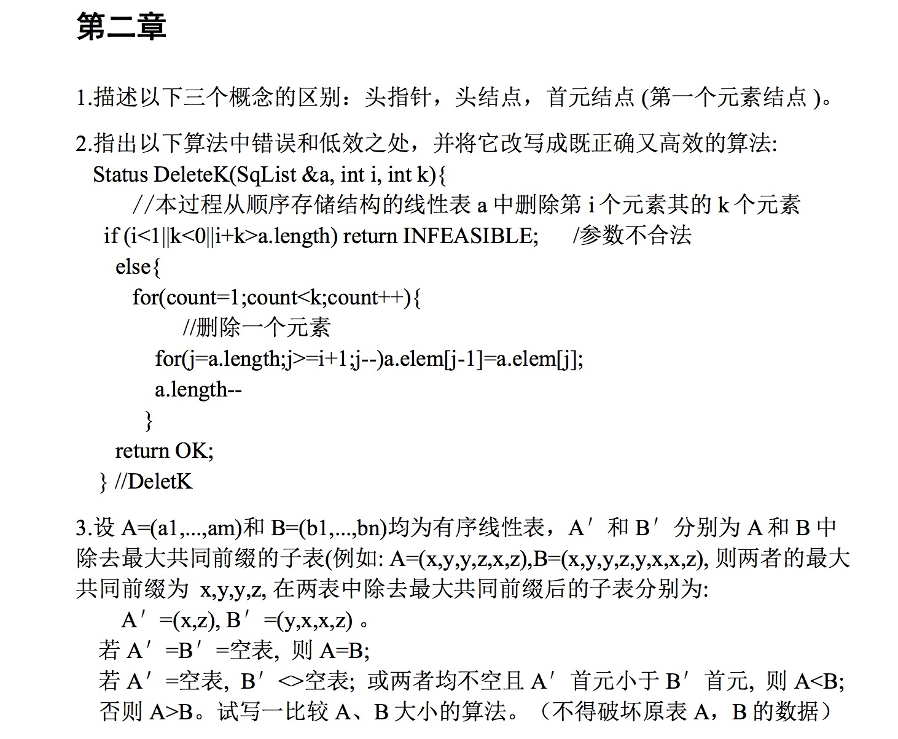

| 次数   | 作业三        |
| ---- | ---------- |
| 姓名   | 王德杰        |
| 学号   | 2015101065 |

----



1. 描述以下三个概念的区别：头指针，头结点，首元结点（第一个元素结点）。

* 头指针：指向链表中第一个结点的指针。
* 首元结点：指链表中存储第一个数据元素的结点。
* 头结点：在首元结点之前附设的一个结点，该结点不存储数据元素，其指针域指向首元结点，其作用主要是为了方便对链表的操作。它可以对空表、非空表以及首元结点的操作进行统一处理。


2. 指出以下算法中的错误和低效之处，并将它改写为一个既正确又高效的算法，答案如下。

 ```C
 Status DeleteK(SqList &a,int i,int k) 
 { 
 //从顺序存储结构的线性表 a 中删除第 i 个元素起的 k 个元素 
 //注意 i 的编号从 0 开始 
 int j; 
 if(i<0||i>a.length-1||k<0||k>a.length-i) return INFEASIBLE; 	
 for(j=0;j<=k;j++)
 	a.elem[j+i]=a.elem[j+i+k];

 a.length=a.length-k;
 return OK;
 }
 ```

3.

```c
Status CompareOrderList(SqList &A,SqList &B) {
         int i,k,j;
         k=A.length>B.length?A.length:B.length;
         for(i=0;i<k;i++){
              if(A.elem[i]>B.elem[i]) j=1;
              if(A.elem[i]<B.elem[i]) j=-1;
         }
         if(A.length>k) j=1;
         if(B.length>k) j=-1;
         if(A.length==B.length) j=0;
         return j;
}
```

